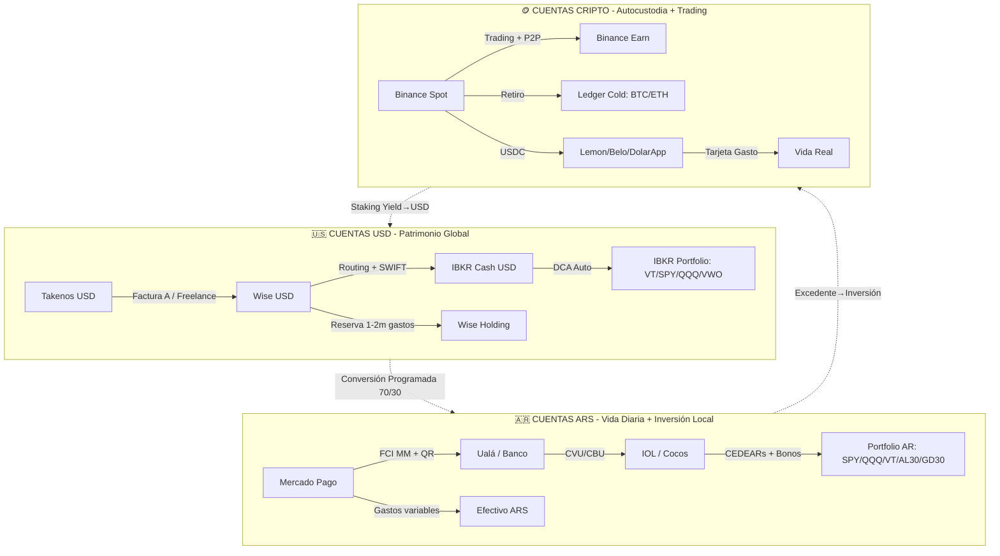

# 💰 Cuentas y Finanzas Personales - Dashboard Vivo

> **Fuente de verdad única** para snapshot patrimonial multi-moneda. Se actualiza via automatizaciones (n8n/GitHub Apps Script) + revisión manual mensual. Ver `📊 Portfolio Tracker Setup` para arquitectura completa.

---

## 🏗️ Arquitectura de Cuentas (Buckets Reales)



---

## 📊 Snapshot Patrimonial Actual (Auto-calculado)

> **Última sincronización**: `{{date:YYYY-MM-DD HH:mm}}` | **Fuente**: Google Sheets `Portfolio_Master` + Notion `Assets` DB

### **Resumen por Moneda (Valuación ARS al TC MEP/CCL)**

| Moneda | Valor USD | TC Ref (ARS) | Valor ARS | % Total | Última Actualización |
|--------|-----------|--------------|-----------|---------|---------------------|
| **USD** | `$0.00` | `$0` | `$0` | `0%` | `Nunca` |
| **ARS** | `$0.00` | `1.0` | `$0` | `0%` | `Nunca` |
| **USDC/USDT** | `$0.00` | `$0` | `$0` | `0%` | `Nunca` |
| **BTC** | `$0.00` | `$0` | `$0` | `0%` | `Nunca` |
| **ETH** | `$0.00` | `$0` | `$0` | `0%` | `Nunca` |
| **TOTAL** | **`$0.00`** | | **`$0`** | **`100%`** | |

> 🔄 **Para activar**: Configurar `📊 Portfolio Tracker Setup` → Google Sheets + n8n/GHA → Este dashboard se auto-puebla via Dataview/Script.

---

## 🏦 Detalle por Cuenta (Editable Manual / Auto-sync)

### **🇺🇸 Cuentas USD (Internacional)**

| Cuenta | Institución | Tipo | Saldo USD | Saldo ARS (est.) | Último Sync | Estado | Props |
|--------|-------------|------|-----------|------------------|-------------|--------|-------|
| `Takenos USD` | Takenos | Cobro/Conversión | `0.00` | `0` | `Nunca` | 🟢 Activa | `funding_source: freelance` |
| `Wise USD` | Wise | Cuenta propia / FX | `0.00` | `0` | `Nunca` | 🟢 Activa | `routing: yes, swift: yes` |
| `IBKR Cash` | Interactive Brokers | Broker / Remunerada | `0.00` | `0` | `Nunca` | 🟢 Activa | `apy: 4.5%, ibkr_lite: no` |
| `IBKR Portfolio` | Interactive Brokers | Inversión (ETFs) | `0.00` | `0` | `Nunca` | 🟢 Activa | `saa: global_etfs` |

### **🇦🇷 Cuentas ARS (Local + Inversión Argentina)**

| Cuenta | Institución | Tipo | Saldo ARS | Saldo USD (est.) | Último Sync | Estado | Props |
|--------|-------------|------|-----------|------------------|-------------|--------|-------|
| `Mercado Pago` | Mercado Pago | Wallet / FCI MM | `0` | `0.00` | `Nunca` | 🟢 Activa | `fci_mm: yes, card: yes` |
| `Ualá / Banco` | Ualá / Banco Trad | Cuenta vista / Ahorro | `0` | `0.00` | `Nunca` | 🟢 Activa | `cbu: yes, cvu: yes` |
| `IOL Portfolio` | InvertirOnline | Broker AR (CEDEARs) | `0` | `0.00` | `Nunca` | 🟢 Activa | `saa: ar_cedears_bonds` |
| `Cocos Portfolio` | Cocos Capital | Broker AR (Híbrido) | `0` | `0.00` | `Nunca` | 🟡 Standby | `crypto_integrated: yes` |
| `Efectivo ARS` | Físico | Efectivo | `0` | `0.00` | `Manual` | 🟢 Activa | `emergency_buffer: yes` |

### **🪙 Cuentas Cripto (Exchange + Cold Storage)**

| Cuenta | Institución | Tipo | BTC | ETH | USDC/USDT | Otros | Saldo USD (est.) | Último Sync | Estado |
|--------|-------------|------|-----|-----|-----------|-------|------------------|-------------|--------|
| `Binance Spot` | Binance | Exchange / Trading | `0` | `0` | `0` | `-` | `0.00` | `Nunca` | 🟢 Activa |
| `Binance Earn` | Binance | Staking/Lending | `-` | `0` | `0` | `SOL, ADA` | `0.00` | `Nunca` | 🟢 Activa |
| `Lemon/Belo` | Lemon/Belo | Wallet + Card | `-` | `-` | `0` | `-` | `0.00` | `Nunca` | 🟢 Activa |
| `Ledger Cold` | Ledger (HW) | Cold Storage | `0` | `0` | `-` | `-` | `0.00` | `Manual` | 🔐 Segura |
| `MetaMask` | MetaMask (Hot) | DeFi / Web3 | `-` | `0` | `0` | `ARB, OP, BASE` | `0.00` | `Manual` | 🟡 Activa |

---

## 📈 Métricas de Salud Financiera (KPIs)

> Calculadas automáticamente desde `Portfolio Tracker` + `Presupuesto`

| Métrica | Actual | Target | Status | Fórmula |
|---------|--------|--------|--------|---------|
| **Patrimonio Neto Total (ARS)** | `$0` | `> $50M` | ⚪ | `Σ Todos los assets ARS` |
| **Patrimonio Neto Total (USD)** | `$0` | `> $50k` | ⚪ | `Total ARS / TC MEP` |
| **Tasa Ahorro Neta (Mensual)** | `0%` | `> 30%` | ⚪ | `(Inversiones + ΔEmergencia) / Ingreso Neto` |
| **Días Antigüedad Dinero** | `0` | `> 30` | ⚪ | `YNAB Age of Money / Actual Budget` |
| **Fondo Emergencia (Meses Gasto)** | `0` | `≥ 6` | ⚪ | `Saldo Emergencia / Gasto Promedio 3m` |
| **Ratio Supervivencia (ARS)** | `0%` | `< 65%` | ⚪ | `Gasto Nivel 1 / Ingreso ARS` |
| **Cobertura FI (25x Gasto Anual)** | `0%` | `> 100%` | ⚪ | `Portfolio / (Gasto Anual × 25)` |
| **Concentración Top 5 Activos** | `0%` | `< 40%` | ⚪ | `Σ Top 5 MV / Total MV` |
| **Deuda Neta** | `$0` | `$0` | ⚪ | `Deudas - Efectivo Disponible` |

---

## 💱 Flujo de Fondos Mensual (Automatizado)

```
┌─────────────────────────────────────────────────────────────────────────────┐
│                         FLUJO ESTÁNDAR MES (1ro-5to)                        │
├─────────────────────────────────────────────────────────────────────────────┤
│                                                                             │
│  📥 INGRESOS USD (Bug Bounty / Freelance / Export)                         │
│       │                                                                     │
│       ▼                                                                     │
│  🏦 Takenos / Wise (Recibo USD)                                            │
│       │                                                                     │
│       ├── 70% ──► 💱 Convertir USD→ARS (Takenos P2P / Wise) ──► Mercado Pago
│       │                                                                     │
│       └── 30% ──► 💵 Quedar USD ──► Wise Holding / IBKR Cash               │
│                                                                             │
│  📥 INGRESOS ARS (Sueldo / Honorarios Locales / Alquileres)                │
│       │                                                                     │
│       ▼                                                                     │
│  🏦 Mercado Pago / Banco (Recibo ARS)                                      │
│                                                                             │
├─────────────────────────────────────────────────────────────────────────────┤
│                         ASIGNACIÓN AUTOMÁTICA (DCA)                         │
├─────────────────────────────────────────────────────────────────────────────┤
│                                                                             │
│  🇦🇷 ARS Disponible (post-gastos fijos)                                    │
│       ├── 50% ──► IOL: CEDEARs (SPY/QQQ/VT) + Bonos (AL30/GD30)            │
│       ├── 30% ──► FCI Money Market / MP (Liquidez + Rendimiento)          │
│       └── 20% ──► Buffer Inflación / Oportunidad                           │
│                                                                             │
│  🇺🇸 USD Disponible (post-reserva 1-2m)                                    │
│       ├── 60% ──► IBKR: VT (25%) + SPY (20%) + QQQ (10%) + VWO (5%)       │
│       ├── 20% ──► Trading 212: Pies Autoinvest (Tech, Clean, Global)      │
│       ├── 10% ──► Binance: DCA BTC (7%) + ETH (3%)                         │
│       └── 10% ──► Stablecoins USDC (Belo/DolarApp) para gasto/tarjeta      │
│                                                                             │
└─────────────────────────────────────────────────────────────────────────────┘
```

---

## 🔄 Estado de Sincronización (Automatizaciones)

| Origen | Destino | Frecuencia | Último Run | Estado | Próximo Run |
|--------|---------|------------|------------|--------|-------------|
| **Binance API** | Sheets `Holdings_Raw` / Notion `Assets` | Diario 06:00 | `Nunca` | ⚪ Pendiente | Mañana 06:00 |
| **IBKR Flex Query** | Sheets / Notion | Diario 07:00 | `Nunca` | ⚪ Pendiente | Mañana 07:00 |
| **IOL/Cocos CSV (Email)** | Sheets / Notion | Mensual 1ro 02:00 | `Nunca` | ⚪ Pendiente | 1ro Próx. Mes |
| **CoinGecko Prices** | Sheets `Prices_Live` | Cada 30 min | `Nunca` | ⚪ Pendiente | En 30 min |
| **BCRA USD/MEP/CCL** | Sheets `Config` | Diario 10:00 | `Nunca` | ⚪ Pendiente | Mañana 10:00 |
| **Takenos/Wise Webhook** | Sheets `Income_Log` / Notion | Event-driven | `Nunca` | ⚪ Pendiente | Al recibir pago |
| **Gastos Telegram Bot** | Sheets `Gastos_Log` / Notion | Event-driven | `Nunca` | ⚪ Pendiente | Al registrar |
| **Monthly Snapshot** | Sheets `Archive_YYYY` | Mensual 1ro 00:05 | `Nunca` | ⚪ Pendiente | 1ro Próx. Mes |
| **Rebalance Check** | Telegram Alert + Notion Task | Semanal Lun 09:00 | `Nunca` | ⚪ Pendiente | Próx. Lunes |
| **Fiscal Snapshot 31/12** | Sheets `Fiscal_YYYY` + Koinly CSV | Anual 31 Dic 23:00 | `Nunca` | ⚪ Pendiente | 31/12/2026 |

---

## 📋 Acciones Pendientes (Dashboard de Tareas)

```dataview
TASK
FROM "02 - Finanzas"
WHERE !completed AND (tags.includes("cuentas") OR tags.includes("account") OR tags.includes("sync"))
SORT priority ASC, due ASC
LIMIT 10
```

---

## 📝 Registro de Cambios Recientes

| Fecha | Cambio | Cuenta Afectada | Detalle |
|-------|--------|-----------------|---------|
| `2026-08-28` | **Migración Vault** | Todas | Unificación Vault 1→2, restructura completa |
| `2024-08-13` | Update manual | Binance, USDC | Saldos registrados manualmente |
| `2024-01-01` | Creación | - | Nota original creada |

---

## 🔗 Enlaces Rápidos (Acciones Comunes)

| Acción | Enlace / Comando |
|--------|------------------|
| **Ver Portfolio Completo** | `[[📊 Portfolio Tracker Setup]]` → Google Sheets / Notion |
| **Registrar Gasto Rápido** | Telegram: `/gasto 5000 supermercado` |
| **Registrar Ingreso USD** | Telegram: `/ingreso 500 usd takenos` |
| **Ver Rebalance Necesario** | `[[📈 Plantillas Estrategia Inversión]]` → Plantilla 4 |
| **Ejecutar DCA Manual** | IBKR App / IOL App / Binance Recurring Buy |
| **Generar Factura (Takenos)** | Auto via Webhook al recibir pago |
| **Snapshot Fiscal Manual** | `[[🇦🇷 Guía Fiscal Inversiones Argentina 2026]]` → Checklist |
| **Ver Budget vs Real** | `[[💸 Presupuesto y Cashflow System]]` → Actual Budget / Sheets |

---

## ⚙️ Configuración Técnica (Para Automatizaciones)

```yaml
# Config para scripts/n8n/GHA - NO EDITAR MANUALMENTE
cuentas_config:
  # Google Sheets
  sheet_id: "TU_SHEET_ID_AQUI"
  tabs:
    holdings_raw: "Holdings_Raw"
    prices_live: "Prices_Live"
    holdings_calc: "Holdings_Calc"
    transactions: "Transactions"
    fiscal_events: "Fiscal_Events"
    archive_template: "Archive_YYYY"
  
  # Notion Databases
  notion:
    assets_db: "NOTION_ASSETS_DB_ID"
    transactions_db: "NOTION_TXNS_DB_ID"
    prices_db: "NOTION_PRICES_DB_ID"
    fiscal_db: "NOTION_FISCAL_DB_ID"
  
  # APIs Keys (en Secrets Manager / .env)
  apis:
    binance: {key: "ENV", secret: "ENV", read_only: true}
    ibkr: {flex_token: "ENV", query_id: "ENV"}
    coincgecko: {demo_key: "ENV"}
    bcra: {public: true}
    takenos: {webhook_secret: "ENV", api_key: "ENV"}
    wise: {api_token: "ENV"}
    telegram: {bot_token: "ENV", chat_id: "ENV"}
    afip: {cert_path: "ENV", key_path: "ENV", cuit: "ENV"}
  
  # Monedas y TC
  currencies:
    base: "ARS"
    reference_rates:
      USD_ARS_MEP: "BCRA_API_OR_COCOS"
      USD_ARS_CCL: "BCRA_API_OR_COcos"
      USD_ARS_OFICIAL: "BCRA_API"
    crypto_vs: "USDC"  # Valuar crypto en USDC para estabilidad
  
  # Reglas de Negocio
  rules:
    dca_allocation:
      ars: {cedears: 0.5, fci_mm: 0.3, buffer: 0.2}
      usd: {ibkr_etfs: 0.6, t212_pies: 0.2, crypto: 0.1, stable: 0.1}
    rebalance_bands: 0.05  # ±5% absoluto
    min_trade_usd: 500
    emergency_months: 6
    savings_rate_target: 0.30
```

---

## 🛠️ Cómo Activar el Dashboard Vivo

```
[ ] 1. Crear Google Sheets "Portfolio_Master" con tabs definidos arriba
[ ] 2. Configurar Service Account Google + dar acceso Editor al Sheet
[ ] 3. Crear Notion Databases (Assets, Transactions, Prices, Fiscal) + Integration Token
[ ] 4. Elegir orquestador: n8n (VPS) O GitHub Actions (Free) O Apps Script (Simple)
[ ] 5. Deploy workflows: Daily Price Sync + Monthly Import + Rebalance Check
[ ] 6. Configurar Telegram Bot + comandos /gasto /ingreso /portfolio /rebalance
[ ] 7. Test end-to-end: Pago prueba Takenos → Factura → Sheets → Notion → Telegram
[ ] 8. Importar histórico 2024-2025 (CSVs brokers) → Validar contra PP
[ ] 9. Configurar Monthly Snapshot (1ro cada mes) + Fiscal Snapshot (31/12)
[ ] 10. Compartir Sheet/Notion con Contador (Solo Lectura)
[ ] 11. Documentar runbook en Notion: "Cómo operar el sistema financiero"
```

---

*Última actualización: 2026-08-28 | **Esta nota es un dashboard vivo**: los valores se poblan via automatizaciones. La tabla "Snapshot Patrimonial" y "Detalle por Cuenta" son placeholders hasta activar el pipeline.*