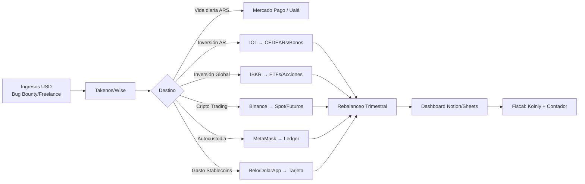

# 🧩 Matriz Comparativa: Apps de Finanzas Completas (2026)

> **Una sola tabla para decidir qué apps instalar**. Cubre: Acciones/CEDEARs, Cripto/Exchange, Inversión/ETFs, Gestión/Presupuesto, Internacional/Multi-moneda, Fiscal/Reportes.

---

## 📊 Matriz Maestra: 20 Plataformas × 25 Criterios

| # | Plataforma | Tipo Principal | 🇦🇷 AR | 🌍 Int'l | 📈 Acciones/CEDEARs | 🪙 Cripto/Exchange | 📊 ETFs/Fondos | 💰 Gestión/Presupuesto | 🏦 Multi-moneda | 📋 Fiscal/Reportes | 🔐 Seguridad | ⭐ UX Móvil | 💸 Costos | Veredicto |
|---|------------|----------------|--------|----------|---------------------|--------------------|----------------|------------------------|-----------------|--------------------|--------------|-------------|-----------|-----------|
| 1 | **IOL** | Broker AR | ✅ | ❌ | ⭐⭐⭐⭐⭐ | ❌ | ⭐⭐⭐⭐ (FCI) | ❌ | ❌ | ⭐⭐⭐ (basico) | 2FA+Bio | ⭐⭐⭐⭐⭐ | $0 comision CEDEARs | **Mejor AR accion** |
| 2 | **Cocos** | Broker AR Híbrido | ✅ | ❌ | ⭐⭐⭐⭐⭐ | ⭐⭐⭐⭐ (spot) | ⭐⭐⭐⭐ (FCI) | ❌ | ❌ | ⭐⭐⭐ | 2FA+Bio | ⭐⭐⭐⭐⭐ | Competitivo | **Mejor todo-en-uno AR** |
| 3 | **Balanz** | Broker AR | ✅ | ❌ | ⭐⭐⭐⭐⭐ | ❌ | ⭐⭐⭐⭐ (FCI) | ❌ | ❌ | ⭐⭐⭐ | 2FA+Bio | ⭐⭐⭐⭐ | Competitivo | **Más estable AR** |
| 4 | **PPI** | Broker AR | ✅ | ❌ | ⭐⭐⭐⭐ | ❌ | ⭐⭐⭐⭐ | ❌ | ❌ | ⭐⭐⭐ | 2FA+Bio | ⭐⭐⭐⭐ | Competitivo | **Screeners AR** |
| 5 | **Bull Market** | Broker AR Trading | ✅ | ❌ | ⭐⭐⭐⭐ (futuros) | ❌ | ⭐⭐⭐ | ❌ | ❌ | ⭐⭐ | 2FA+Bio | ⭐⭐⭐⭐ | Futuros baratos | **Trading AR** |
| 6 | **IBKR** | Broker Global | ✅ | ✅ | ⭐⭐⭐⭐⭐ (global) | ❌ | ⭐⭐⭐⭐⭐ | ❌ | ✅ (base) | ⭐⭐⭐⭐⭐ (pro) | 2FA+HW | ⭐⭐⭐⭐ | $0 US stocks | **Rey global** |
| 7 | **XTB** | Broker EU | ✅ | ✅ | ⭐⭐⭐⭐ (CFD/Real) | ❌ | ⭐⭐⭐⭐ | ❌ | ✅ | ⭐⭐⭐ | 2FA+Bio | ⭐⭐⭐⭐ | Spreads bajos | **Alternativa IBKR** |
| 8 | **Trading 212** | Broker EU/UK | ✅ | ✅ | ⭐⭐⭐⭐ (real) | ❌ | ⭐⭐⭐⭐⭐ (pies) | ❌ | ✅ | ⭐⭐ | 2FA+Bio | ⭐⭐⭐⭐⭐ | $0 + pies | **Mejor pies gratis** |
| 9 | **Binance** | Exchange Cripto | ✅ | ✅ | ❌ | ⭐⭐⭐⭐⭐ | ❌ | ⭐⭐ (Earn) | ✅ (P2P) | ⭐⭐ (basico) | 2FA+HW+Anti-phish | ⭐⭐⭐⭐ | Muy bajos | **Rey cripto** |
| 10 | **Bybit** | Exchange Cripto | ✅ | ✅ | ❌ | ⭐⭐⭐⭐⭐ (deriv) | ❌ | ⭐⭐ (Earn) | ✅ | ⭐⭐ | 2FA+HW | ⭐⭐⭐⭐ | Muy bajos | **Derivados cripto** |
| 11 | **Kraken** | Exchange Cripto | ✅ | ✅ | ❌ | ⭐⭐⭐⭐⭐ (spot) | ❌ | ⭐⭐ (Staking) | ✅ | ⭐⭐⭐ | 2FA+HW+Master Key | ⭐⭐⭐ | Medios | **Seguridad cripto** |
| 12 | **Bitso** | Exchange LATAM | ✅ | ❌ | ❌ | ⭐⭐⭐⭐ (ARS) | ❌ | ❌ | ❌ | ⭐⭐ | 2FA+Bio | ⭐⭐⭐⭐ | Medios | **Fiat AR nativo** |
| 13 | **Lemon** | Fintech AR Cripto | ✅ | ❌ | ❌ | ⭐⭐⭐⭐ (ARS) | ❌ | ⭐⭐⭐ (gasto) | ❌ | ⭐⭐ | 2FA+Bio | ⭐⭐⭐⭐⭐ | Medios | **Mejor UX AR cripto** |
| 14 | **Buenbit/Nexo** | CeFi Lend/Borrow | ✅ | ✅ | ❌ | ⭐⭐⭐⭐ | ❌ | ⭐⭐⭐ (rendimiento) | ✅ (USDC) | ⭐⭐ | 2FA+Bio | ⭐⭐⭐⭐ | Variables | **Rendimiento stable** |
| 15 | **Belo** | Wallet + Card | ✅ | ✅ | ❌ | ⭐⭐⭐ (USDC) | ❌ | ⭐⭐⭐⭐ (gasto) | ✅ (USDC/ARS) | ⭐⭐ | 2FA+Bio | ⭐⭐⭐⭐⭐ | 0% gasto | **Spend stablecoins** |
| 16 | **DolarApp** | USD Digital AR | ✅ | ✅ | ❌ | ⭐⭐⭐ (USDC) | ❌ | ⭐⭐⭐ (ahorro) | ✅ (USD/ARS) | ⭐⭐ | 2FA+Bio | ⭐⭐⭐⭐ | 0% spread | **Mejor USD digital** |
| 17 | **Mercado Pago** | Wallet AR | ✅ | ❌ | ⭐⭐ (FCI) | ⭐⭐ (limitado) | ⭐⭐ (FCI) | ⭐⭐⭐⭐⭐ | ❌ | ⭐⭐ | 2FA+Bio | ⭐⭐⭐⭐⭐ | Gratis | **Vida diaria AR** |
| 18 | **Ualá** | Neobanco AR | ✅ | ❌ | ⭐⭐ (FCI) | ⭐⭐ (limitado) | ⭐⭐ (FCI) | ⭐⭐⭐⭐ | ❌ | ⭐⭐ | 2FA+Bio | ⭐⭐⭐⭐⭐ | Gratis | **Banco digital AR** |
| 19 | **Wise** | Transferencias Int'l | ✅ | ✅ | ❌ | ❌ | ❌ | ⭐⭐ (gasto) | ✅⭐⭐⭐⭐⭐ | ⭐⭐ | 2FA+Bio | ⭐⭐⭐⭐⭐ | Bajísimos | **Infra USD→ARS** |
| 20 | **Takenos** | Cobro Freelance | ✅ | ✅ | ❌ | ⭐⭐ (USDC) | ❌ | ❌ | ✅⭐⭐⭐⭐ | ⭐⭐ | 2FA+Bio | ⭐⭐⭐⭐ | 1-2% | **Cobro Bug Bounty** |

---

## 🎯 Matriz por Caso de Uso: ¿Qué necesito HOY?

### **Caso 1: "Quiero comprar CEDEARs de NVDA/AAPL/MSFT desde Argentina"**
| Prioridad | App | Por qué |
|-----------|-----|---------|
| 1 | **IOL** | App móvil #1, $0 comisión CEDEARs, widgets, alertas |
| 2 | **Cocos** | Si también querés cripto en misma app |
| 3 | **Balanz** | Si valorás estabilidad > features |

### **Caso 2: "Quiero ETFs globales (SPY, QQQ, VT, VWRL) con custodia real"**
| Prioridad | App | Por qué |
|-----------|-----|---------|
| 1 | **IBKR GlobalTrader** | Onboarding 100% móvil, acciones fraccionadas, $0 US |
| 2 | **Trading 212** | Pies automáticos, UX móvil excelente, $0 |
| 3 | **XTB** | Spreads bajos, cuenta remunerada EUR/USD |

### **Caso 3: "Quiero comprar/vender Bitcoin/Ethereum/Solana con ARS"**
| Prioridad | App | Por qué |
|-----------|-----|---------|
| 1 | **Binance P2P** | Liquidez #1, mejores precios, 24/7 |
| 2 | **Lemon** | UX impecable, tarjeta Mastercard gasta cripto |
| 3 | **Bitso** | Fiat AR nativo, regulado localmente |
| 4 | **Buenbit** | Si querés rendimiento USDC automático |

### **Caso 4: "Quiero gastar USDC/USDT en la vida real (supermercado, suscripciones)"**
| Prioridad | App | Por qué |
|-----------|-----|---------|
| 1 | **Belo** | Tarjeta Mastercard física/virtual, 0% fee conversión |
| 2 | **DolarApp** | Cuenta USD digital, tarjeta, rendimiento 5-8% APY |
| 3 | **Binance Card** | Si ya usás Binance, gasto directo desde funding wallet |

### **Caso 5: "Cobro pagos del exterior (Bug Bounty, freelance, clientes USD)"**
| Prioridad | App | Por qué |
|-----------|-----|---------|
| 1 | **Takenos** | Diseñado para AR, USDC→ARS instant, factura A |
| 2 | **Wise** | Cuenta USD propia (routing + SWIFT), mejor FX |
| 3 | **Binance P2P** | Si el cliente paga en USDT, vendés vos directo |
| 4 | **Payoneer** | Si cliente paga vía plataforma (Upwork, etc.) |

### **Caso 6: "Quiero control total de mis claves (Not your keys, not your coins)"**
| Prioridad | App | Tipo |
|-----------|-----|------|
| 1 | **MetaMask** | Hot wallet Ethereum/EVM + Hardware wallet |
| 2 | **Trust Wallet** | Multi-chain móvil + HW wallet |
| 3 | **Ledger Live + Ledger Nano X/S Plus** | Cold storage #1 |
| 4 | **Trezor Suite + Trezor Safe 3/5** | Cold storage open source |
| 5 | **Exodus** | Desktop/Móvil multi-asset + HW integration |

### **Caso 7: "Quiero un dashboard único que vea TODO (Acciones + Cripto + Banco + Efectivo)"**
| Solución | Tipo | Pros | Contras |
|----------|------|------|---------|
| **Notion + APIs** | DIY | Control total, gratis, flexible | Requiere setup/mantenimiento |
| **Google Sheets + Google Finance** | DIY | Gratis, fórmulas nativas, colaborativo | Límite API, sin cripto nativo |
| **Portfolio Performance (Desktop)** | Local/FOSS | Privado, potente, import CSV | No móvil nativo, manual sync |
| **CoinStats / CoinGecko Portfolio** | SaaS | Multi-exchange API, móvil | Suscripción, datos en la nube |
| **Delta Investment Tracker** | SaaS | Broker + Crypto + Manual, móvil | Suscripción Pro para features |
| **YNAB / Actual Budget** | Presupuesto | Metodología probada, móvil | Solo gasto/ahorro, no inversiones |

---

## 🏗️ Stacks Recomendados por Perfil (Mínimo Viable)

### **Perfil: Principiante Argentino (Capital < $5k USD)**
```
📱 MÓVIL (3 apps)
├── IOL → CEDEARs + Bonos AR
├── Lemon → Cripto ARS + Tarjeta gasto
└── Mercado Pago → Vida diaria + FCI remunerados

💻 ESCRITORIO (Opcional)
└── Google Sheets → Tracker simple (Google Finance + manual crypto)
```

### **Perfil: Inversor Intermedio (Capital $5k-50k USD)**
```
📱 MÓVIL (5 apps)
├── IOL → CEDEARs núcleo AR
├── IBKR GlobalTrader → ETFs/Acciones globales
├── Binance → Cripto trading + P2P
├── Belo/DolarApp → Gasto stablecoins
└── Wise/Takenos → Infraestructura cobro USD

💻 ESCRITORIO
├── Notion Dashboard → Portfolio unificado + Diario
└── Portfolio Performance → Análisis riesgo/rendimiento local
```

### **Perfil: Inversor Avanzado / Trader (Capital > $50k USD)**
```
📱 MÓVIL (7+ apps)
├── IOL/Cocos → CEDEARs + Arbitraje MEP
├── IBKR Mobile → Opciones + Futuros + Reportes fiscales pro
├── Binance/Bybit → Derivados cripto + Grid/DCA bots
├── MetaMask + Ledger → Autocustodia DeFi
├── Wise → Multi-moneda empresarial
└── Takenos → Facturación exportación servicios

💻 ESCRITORIO
├── TradingView Pro → Análisis multi-monitor
├── IBKR TWS / TWS Mobile → Ejecución pro
├── Custom Dashboard (n8n + Notion/PostgreSQL) → Automatizado
└── Koinly/CoinTracking → Fiscal cripto automatizado
```

---

## 💰 Comparativa de Costos Reales (2026, desde Argentina)

| Operación | IOL | Cocos | Balanz | IBKR | Binance | Lemon | Belo | Wise | Takenos |
|-----------|-----|-------|--------|------|---------|-------|------|------|---------|
| **Comprar CEDEAR $1000** | $0 | $0 | $0 | N/A | N/A | N/A | N/A | N/A | N/A |
| **Comprar SPY $1000 (ETF US)** | N/A | N/A | N/A | **$0** | N/A | N/A | N/A | N/A | N/A |
| **Comprar BTC $1000 (Spot)** | N/A | 0.1-0.5% | N/A | N/A | **0.1%** | 1-2% | N/A | N/A | N/A |
| **Vender USDT → ARS (P2P)** | N/A | ~1% | N/A | N/A | **0.5-1.5%** | ~1.5% | ~1% | N/A | N/A |
| **Recibir $1000 USD (SWIFT)** | N/A | N/A | N/A | $0-10 | N/A | N/A | N/A | **~$5-10** | **1-2%** |
| **Gastar $100 USDC en ARS (Tarjeta)** | N/A | N/A | N/A | N/A | ~2% | N/A | **0%** | N/A | N/A |
| **Mantenimiento cuenta/mes** | $0 | $0 | $0 | $0 (si >$100k o trades) | $0 | $0 | $0 | $0 | $0 |

> ⚠️ **Costos cambian mensualmente**. Verificá siempre en web oficial antes de operar.

---

## 🔐 Matriz de Seguridad: ¿Dónde duermen mis claves?

| Plataforma | Custodia | 2FA | Hardware Key | Seguro/Reserva | Auditoría | Recuperación |
|------------|----------|-----|--------------|----------------|-----------|--------------|
| IOL/Cocos/Balanz | Broker (CNV) | SMS/Authenticator | ❌ | SÍ (Seguro de valores) | CNV/BCRA | CUIT + Docs |
| IBKR | Broker (SIPC $500k) | TOTP + YubiKey | ✅ | SÍ (SIPC + Lloyd's) | SEC/FINRA | Email + Docs + Video |
| Binance | Exchange | TOTP + YubiKey + Passkey | ✅ | SAFU Fund ($1B+) | Múltiples | Email/Phone + KYC |
| Kraken | Exchange | TOTP + YubiKey + Master Key | ✅ | Reserves Proof | PoR trimestral | Email + KYC + Video |
| MetaMask | **Vos (Non-custodial)** | Biometría + Password | ✅ (Ledger/Trezor) | **NO** (Tu responsabilidad) | Código abierto | **Seed phrase 12/24 palabras** |
| Ledger Live | **Vos (Cold)** | PIN + Passphrase | ✅ (Device) | **NO** | Código abierto | **Seed phrase + Passphrase** |
| Belo/DolarApp | Custodio (Parcial) | Biometría + SMS | ❌ | Parcial | BCRA/Regulador | Email + KYC |
| Wise/Takenos | Custodio (Regulado) | 2FA + Biometría | ❌ | FCA/BCRA | Reguladores | Email + KYC |

---

## 📋 Checklist de Decesión Rápida

```
¿Necesito...?                    → App Principal          → Backup/Complemento
─────────────────────────────────────────────────────────────────────────────
CEDEARs Argentina                → IOL                    → Cocos / Balanz
ETFs/Acciones USA real           → IBKR GlobalTrader      → Trading 212 / XTB
Acciones fraccionadas (pies)     → Trading 212            → IBKR
Cripto Spot + P2P ARS            → Binance                → Lemon / Bitso
Derivados Cripto (Futuros/Op)    → Bybit / Binance        → Kraken
Rendimiento USDC/USDT            → Buenbit/Nexo/DolarApp  → Binance Earn
Gastar Stablecoins (Tarjeta)     → Belo                   → DolarApp
Vida diaria ARS (QR/Transfer)    → Mercado Pago           → Ualá
Cuenta USD propia (SWIFT/Routing)→ Wise                   → Takenos
Cobro Exportación Servicios      → Takenos                → Wise / Payoneer
Autocustodia Cripto (Cold)       → Ledger + MetaMask      → Trezor + Trust Wallet
Dashboard Unificado Todo-en-uno  → Notion/Sheets (DIY)    → Delta/CoinStats (SaaS)
Fiscal Automatizado Cripto       → Koinly                 → CoinTracking
```

---

## 🔄 Flujo de Dinero Recomendado (Arquitectura)



---

## 📝 Mantenimiento de esta Matriz

| Frecuencia | Acción |
|------------|--------|
| **Mensual** | Verificar comisiones/spreads en web oficial |
| **Trimestral** | Testear apps móviles (updates iOS/Android) |
| **Semestral** | Revisar ratings App Store/Play Store |
| **Anual** | Re-evaluar stack completo vs nuevas alternativas |
| **Event-driven** | Cambios regulatorios AR (CNV/BCRA/AFIP), hacks exchanges, nuevos brokers |

---

*Última actualización: 2026-08-28 | Fuente: Testing personal + web oficial + App Store/Play Store + BrokerChooser + AwakeTrader + Reddit r/InversionesArgentina*